The goal of this repo is to study a more efficient algorithm for a label position QP solver.

** Related work

| lang   | code    | fun                        | updates    | time | weights | bounds |
|--------+---------+----------------------------+------------+------+---------+--------|
| R      | C       | isoreg()                   |            |      | no      | no     |
| R      | C       | monreg::monreg()           | 2006–2020  |      |         |        |
| R      | C       | fdrtool::monoreg()         | 2006–2021  |      |         |        |
| R      | R       | cir::pava()                | 2008–2024  |      |         |        |
| R      | Fortran | Iso::pava()                | 2008–2020  |      | yes     | no     |
| R      | R       | clue::pava()               | 2004–2026  |      |         |        |
| R      | R       | logcondens::isoMeans()     | 2006–2023  |      |         |        |
| R      | R       | sandwich::pava.blocks()    | 2004–2026  |      |         |        |
| R      | C       | intcox::intcox.pavaC()     | 2006–2013* |      |         |        |
| R      | R       | SAGx::pava.fdr()           | 2005–2006* |      |         |        |
| R      | R       | smacof::pavasmacof()       | 2008–2024  |      |         |        |
| R      | R       | isotone::gpava()           | 2009–2023  |      | yes     |        |
| R      | Fortran | quadprog::solve.QP()       | 1999–2019  | N^3  | yes     | yes    |
| Python | Python  | [[https://scikit-learn.org/stable/modules/generated/sklearn.isotonic.IsotonicRegression.html][sklearn IsotonicRegression]] |            | N?   | yes     | yes    |
| Python | C       | [[https://docs.scipy.org/doc/scipy/reference/generated/scipy.optimize.isotonic_regression.html][scipy isotonic_regression]]  |            | N    | yes     | no     |
| R      | C       | monotone::monotone()       |            | N    | yes     |        |

Table above adapted from
https://cran.r-project.org/web/packages/isotone/vignettes/isotone.pdf
which discusses PAVA but does not discuss dynamic programming. (no big O notation)

- add entries from linear time [[https://www.jstatsoft.org/article/view/v102c01][Busing Jss 2022 paper]]

TODO estimate empirical complexity with atime.

- https://www.sciencedirect.com/science/article/pii/S0305048321001250
- https://arxiv.org/html/2607.12629v1#bib.bib11
- https://www.inf.fu-berlin.de/lehre/WS12/HA/isotonicregression.pdf

** 31 July 2026

[[file:figure-atime-cases-data.R]] makes [[file:figure-atime-cases-data.rds]]

[[file:figure-atime-cases.R]] makes

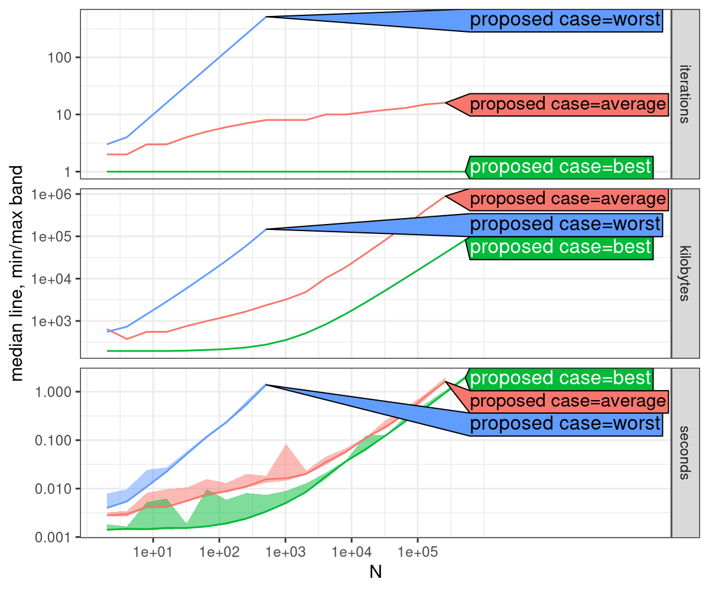

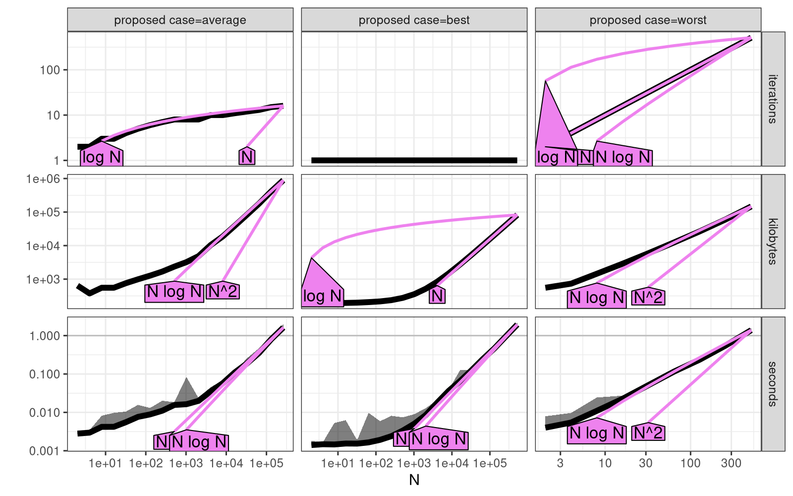

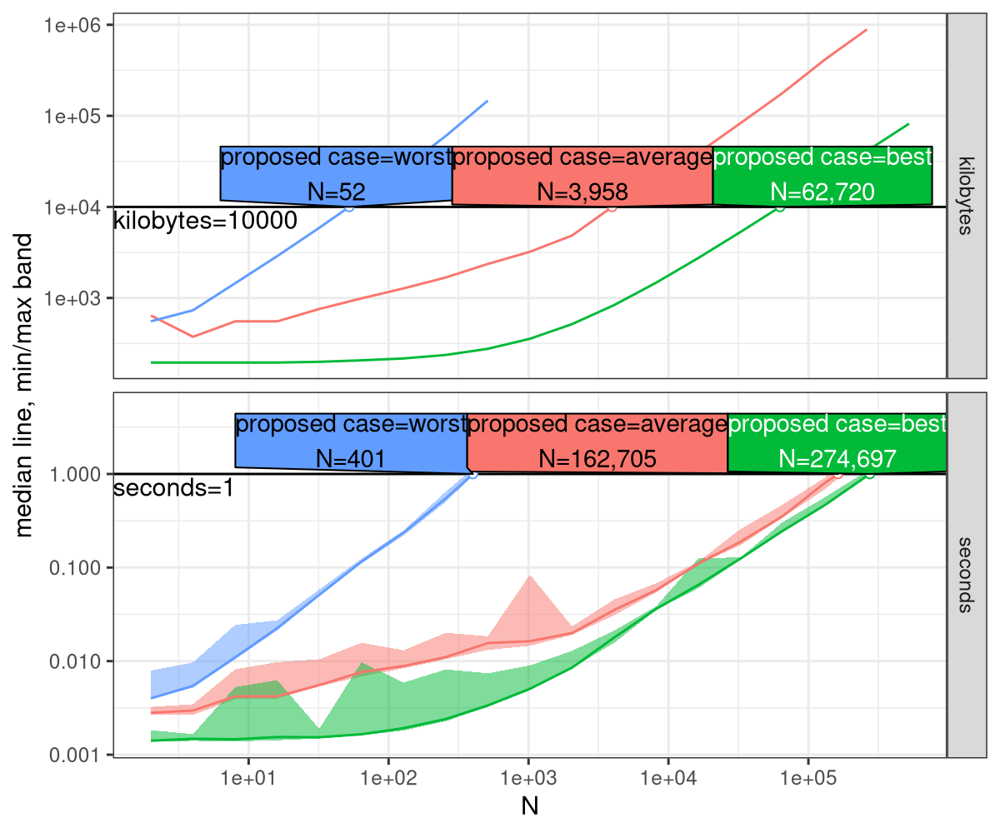

[[file:figure-atime-worst-data.R]] makes [[file:figure-atime-worst-data.rds]]

[[file:figure-atime-worst.R]] makes

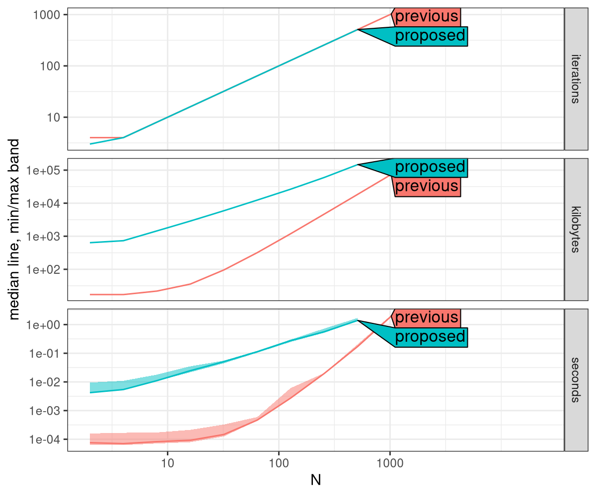

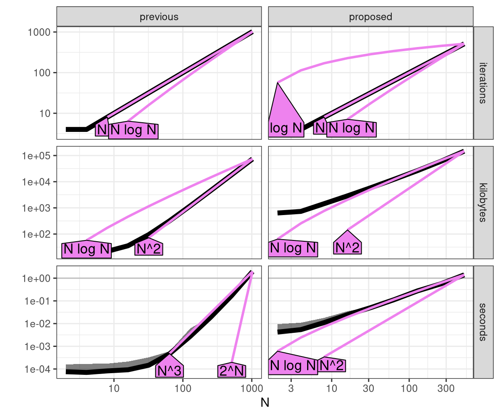

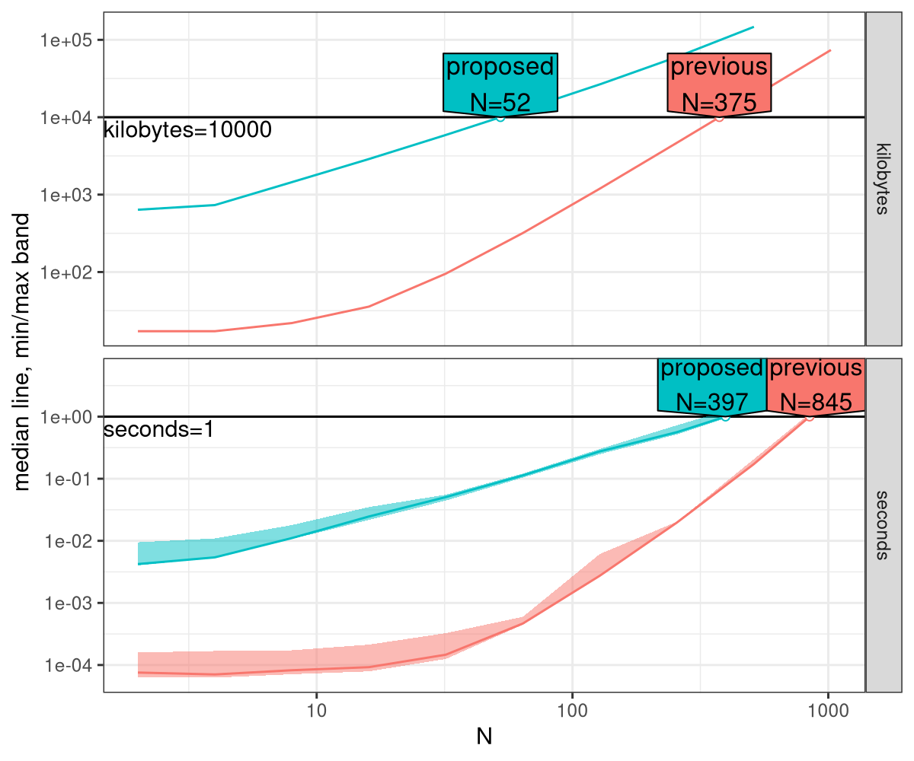

Above we see that iterations is linear, but seconds is log-linear (should be quadratic? maybe N is too small?)

[[file:figure-worst-case.R]] makes

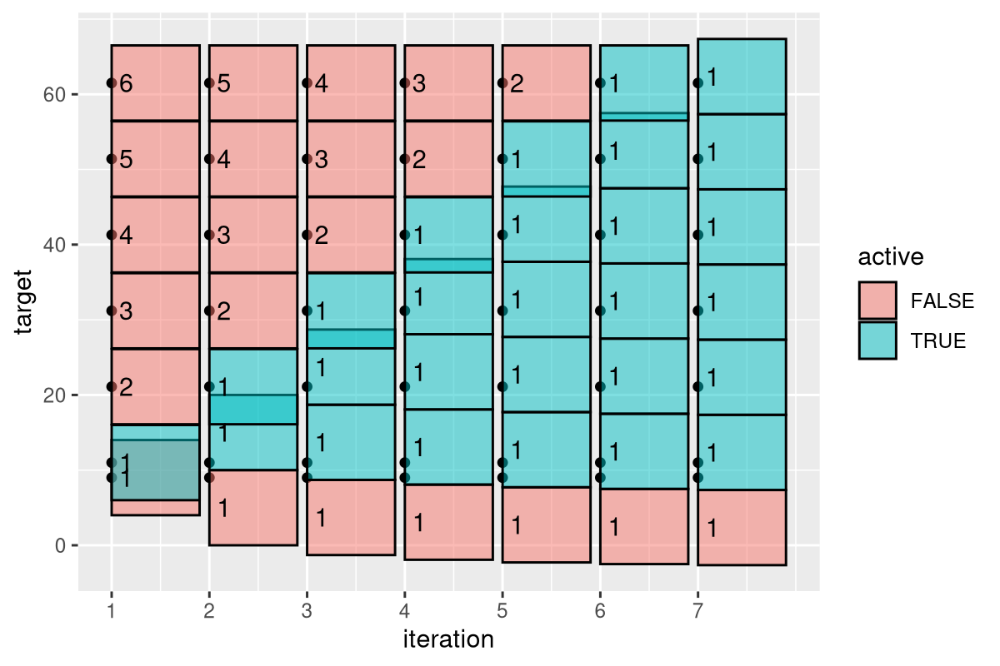

** 30 July 2026

[[file:figure-atime-directlabels-data.R]] makes [[file:figure-atime-directlabels-data.rds]]

[[file:figure-atime-directlabels.R]] makes

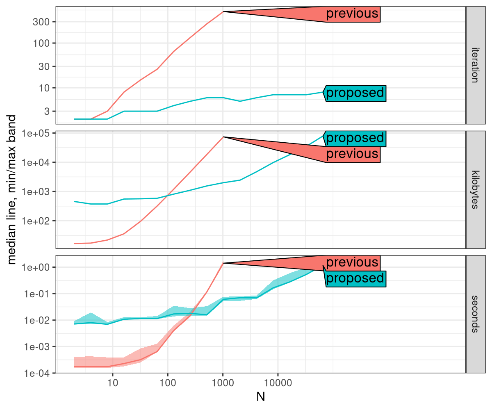

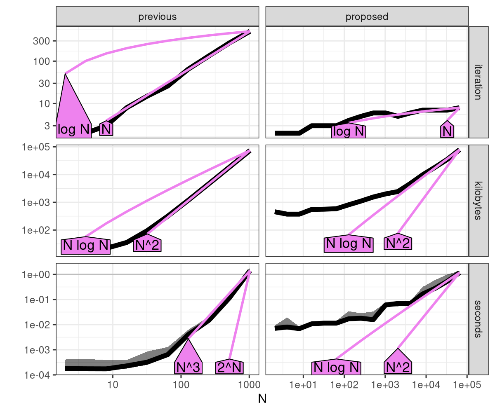

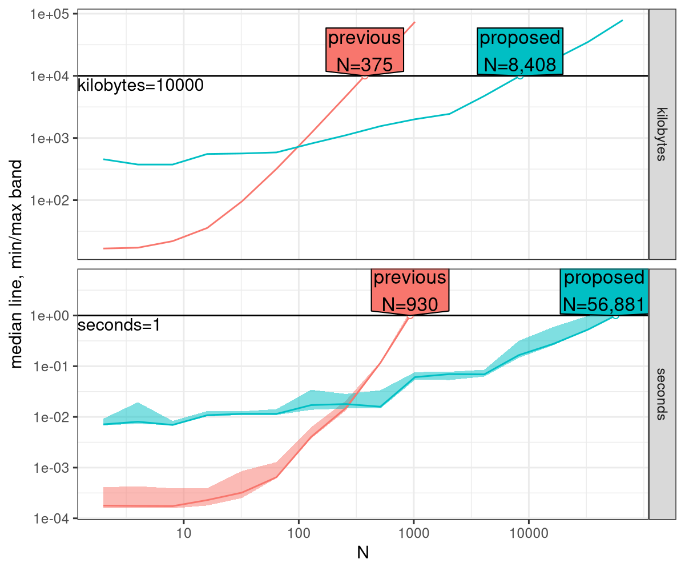

Asypmtotically, we can see that proposed time and memory are
quasi-linear (N log N), whereas previous is cubic time and quadratic
memory. However, there are rarely more than N=10 or 20 labels, so the
previous code is definitely fast enough for practical N values.

[[file:figure-sim.R]] makes

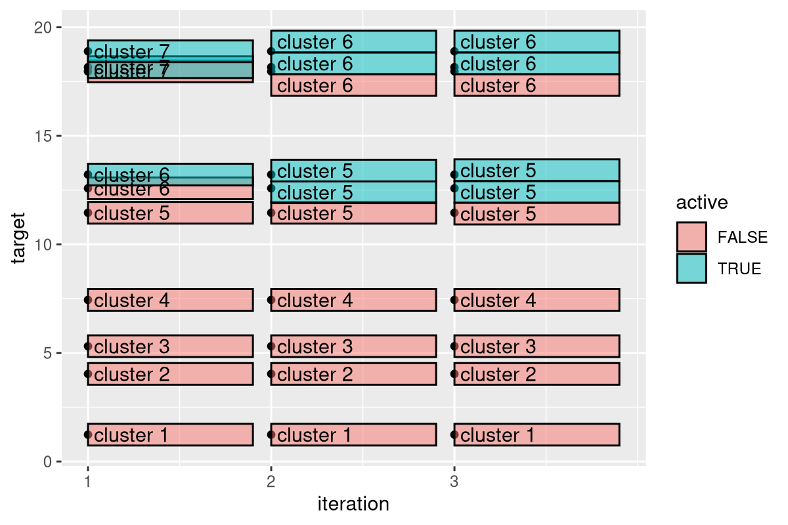

We infer optimal label positions using an iterative algorithm.
Dots represent targets, boxes represent labels.
Each iteration first activates constraints, then computes clusters, and updated positions for each cluster.
The algorithm stops when the update does not move the label positions.
Each iteration is linear time and space in the number of labels.
Above we see the algorithm only needs three iterations for 10 labels.
